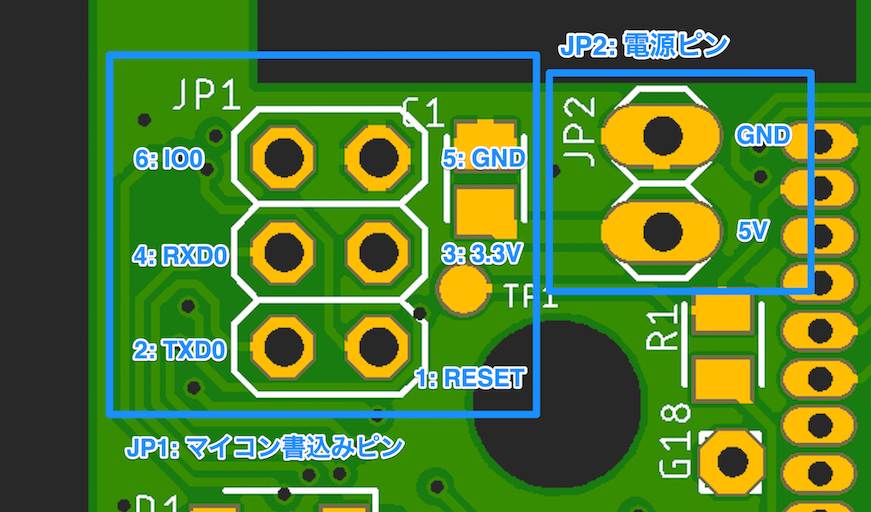

# ハードウェア仕様
「パチパチクラッピーLEDデコデコキットDX」 基板のハードウェア仕様について。  

## 基本的なピン(JP1, JP2)

- JP1: プログラム書込みピンです。発光パターンなどを制御するプログラムを書き込むのに使用します。
- JP2: 電源ピンです。動作に必要な DC 5Vを供給します。

## Extra IO Pin Assigns

拡張用のオプションIOピンのピンアサインについて

| Ref |     Function      |
| --- | ----------------- |
| G21 | G21, I2C SDA      |
| G22 | G22, I2C SCL      |
| G25 | G25, DAC1         |
| G33 | G33, ADC5, TOUCH8 |
| G18 | G18, SPI SCK      |
| G19 | G19, SPI MISO     |
| G23 | G23, SPI MOSI     |

## Schematics

各基板の回路図について

- [Main board](./main-board-sch.pdf)

## Board layout

各基板のレイアウトについて

|       Kind       |           Top view           |           Bottom View           |
| ---------------- | ---------------------------- | ------------------------------- |
| Main board       |       |       |
| MCU board(ESP32) |  |  |