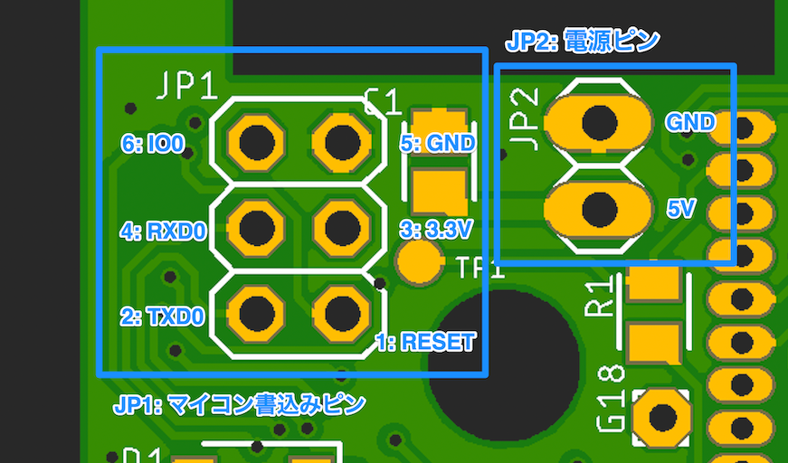

# チュートリアル

## 組立方法

パチパチクラッピーークリアへの組み付け方法については[動画を参照してください。](https://youtu.be/Fq--fv0vHeM)

## 電源ケーブルの接続方法

JP2 に、付属の電源ケーブルを接続し、DC5Vを供給します。

黒のケーブルが上、赤のケーブルが下となるようにケーブルを接続してください。  
組立方法 の動画も参照してください。

## アプリケーションの書き換え方

基板に搭載されているESP32のプログラムを書き換えたり、シリアル通信を行うためには、裏面のJP1(マイコン書込みピン)にESPプログラマーを接続してPCと接続します。

ESPプログラマーは市販のUSB-シリアルアダプタを使用するか、 [FLINT ESP Programmer](http://ichirowo.com/flint-esp-programmer/) 等のESP32に対応したプログラマを使用してください。  

**[例: FLINT ESP Programmer と接続する場合のピン対応表]**  

| 本基板 JP1 | FLINT ESP Programmer のピン |
| ---------- | --------------------------- |
| 1: RESET   | RESET                       |
| 2: TXD0    | RX                          |
| 3: 3.3V    | +3.3V                       |
| 4: RXD0    | TX                          |
| 5: GND     | GND                         |
| 6: IO0     | IO0                         |

プログラマ接続後は、Arduino IDEやesptool等で接続してプログラムを書き換えてください。  
